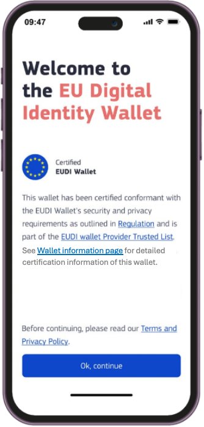

 

# Specification of EUDI Wallet Trust Mark

## Abstract

The present document specifies the technical specification and requirements for EUDI Wallet Trust Mark.

### [GitHub discussion](https://github.com/eu-digital-identity-wallet/eudi-doc-architecture-and-reference-framework/discussions/425)

## Versioning

| Version | Date       | Description                                                                |
|---------|------------|----------------------------------------------------------------------------|
| `0.1`   | 20.01.2025 | Initial version for discussion                                             |
| `0.2`   | 18.02.2025 | Version with first internal feedback and improved scoping                  |
| `0.3`   | 03.03.2025 | Version for public discussion with the Member States                       |
| `0.4`   | 03.04.2025 | Updated version based on discussions in 1st and 2nd focus group meetings   |
| `1.0`   | 25.04.2025 | Final version (v1.0)                                                       |

## 1 Introduction and Overview

The present document specifies technical and procedural aspects related to use of the **EU Digital Identity Wallet Trust Mark** (also referred as **EUDI Wallet Trust Mark** in this document) in the context of the EUDI Wallet, having regard to the [European Digital Identity Regulation], and in particular Articles 5a(5) and 3(50) thereof.

The purpose of a visible and recognisable trust mark is to add trust in the EUDI Wallet ecosystem and help the Users to recognise and validate the certification status of the EUDI Wallet Providers and their EUDI Wallet services.

### 1.1 Requirements in Regulation EU 2024/1183
 - According to Article 3 (50), the EUDI Wallet Trust Mark is defined as **"a verifiable, simple and recognisable indication which is communicated in a clear manner that a European Digital Identity Wallet has been provided in accordance with this Regulation.”** 
 
 - According to Article 5a (5)(a) (iv), **the Trust Mark must be displayed to the User**.
 - According to Article 5a (8)(a), **the Member States shall provide validation mechanisms free-of-charge, in order to: (a) ensure that the authenticity and validity of European Digital Identity Wallets can be verified;**
- According to the Article 5d, the European Commission publishes the list of certified EUDI Wallets as an official list in the Official Journal of the European Union, thus acting as a reference for which Wallet Solutions are certified. **Removal from the list means certification is no longer valid**.

### 1.2 Scope for the Trust Mark Requirements and Design
The EUDI Wallet Trust Mark must be designed and copyright protected, as a kind of label, which is only allowed to be displayed if the EUDI Wallet of the User both complies to the requirements of EUDI Wallet Solutions (is a certified Wallet) while being recognised by at least one Member State. If either of the aforementioned base requirements become non-applicable, the Member States must inform the Commission and the Cooperation Group and state the reason for cancellation. Upon cancellation, the Wallet Provider must remove the visible trust mark from affected Wallet Solution, and any references to it.

The European Commission is responsible for the EUDI Wallet Trust Mark in terms of graphic design, ownership of the logo registration process and takes responsibility for drafting rules and usage guidelines, and distribution to the designated actors within the ecosystem.

As the Regulation does not specify what verifiable means, or where it shall be displayed, the realisation of the EUDI Wallet Trust Mark was conducted via collecting the business requirements, identifying any complexity limitations if any, and considering the priorities of the involved ecosystem stakeholders (Member States). 
 
 > Note (to be removed before v1.0): Current version of the specificaiton reflexes the majority of opinions gathered from the Member States that attended the first meeting handling version 0.3, and those Member States' experts that provided review comments online after the meeting. The technical complexity of the solution was agreed to be minimised - as the ARF already defines technical solution ensuring the cryptographic trust of an individual Wallet Unit (the Wallet Unit Attestation).  

 The proposed mandatory high-level requirements define a solution that focuses on providing the EUDI Trust Mark logo only to valid Wallet Units ('EUDI Wallet Trust Mark'), and providing with it a direct link to the EU list of certified EUDI Wallets and/or the individual Wallet Solution page, located within the eIDAS Dashboard web site. The requirements are presented in the actor-oriented requirement format: **"As an *actor* I shall/should *verb* to achieve *my required goal*"**. 

This document does not address the visual or user experience related design elements related to the trust mark; these are provided separately by the European Commission and may be derived from the final requirements listed in this specification.
 
 >NOTE 1: The presence and rendering of the EUDI Wallet Trust Mark in a Wallet Unit could also be bound to validity of the WUA. The third parties or European Commission MAY later decide to operate a wallet certification verification service based on presenting the WUA for this service, thus allowing on-demand verification of the Wallet Solution certification status for the User. The operating principle of this simple verification service is specified broadly in Section 2.2, and any requirements or components related to it marked as **OPTIONAL** in Sections 3 and 4 detailing exact technical solution.

>NOTE 2: Any possible requirements for trust indicators unrelated to the EUDI Wallet Solution are out of scope of this document. **The scope is the trust mark visible in the EUDI Wallet, not the Relying Party services and/or the Attestation Provider qualifications**. The Trust Mark analysis and solution may at a later stage be extended to other elements of the European Digital Identity ecosystem, so that the Users can be informed regarding the reliability and trustworthiness of the different Relying Parties they interact with.

### 1.3 Background: Existing European trust marks as a reference

To our knowledge, the European Commission has launched a few business-to-consumer type trust mark programmes related to EU Regulations: the earlier being the EU Trust Mark for Qualified Trust Services (launched as an Implementing Act for eIDAS Regulation) and the newer Ecommerce Europe Trustmark for safe and ethical cross-border ecommerce. These trust marks are both bound to EU regulation, but are probably facing very different types of end customers and their awareness among EU Member State citizens is probably not actively studied. These are included to provide a comparison/starting point for the EUDI Wallet Trust Mark specification.

#### 1.3.1 EU Trust Mark for Qualified Trust Services

[Commission Implementing Regulation (EU) 2015/806 of 22 May 2015 laying down specifications relating to the form of the EU trust mark for qualified trust services](http://data.europa.eu/eli/reg_impl/2015/806/oj) specifies a trust mark for QTSPs. Use of the trust mark is optional and it is not verifiable according to Article 23 (1) of Regulation 910/2014 (the eIDAS Regulation), therefore the way this trust mark is implemented may not meet the needs of EUDI Wallet Trust Mark.

Some visible uses of the QTSP trust mark for reference:

- [**TrustPro Web Page**](https://www.trustpro.eu/): Interactive logo, test this by browsing to the home page section just before the page footer area. Clicking on the EU Trust Mark links to the [EU/EEA Trusted List Browser](https://eidas.ec.europa.eu/efda/trust-services/browse/eidas/tls) page.
- [**Penneo QTSP page (blog)**](https://penneo.com/blog/qualified-trust-service-providers/): Passive use of the logo on the informative QTSP related blog page. The logo is in no way related to validation, the available validation means (checking from the EU LTL via the eIDAS Dashboard) are explained separately in the main text.

This overview of samples is in no way exhaustive as there may be well-hidden trust mark appearances among the EU QTSP web pages.

#### 1.3.2 Ecommerce Europe

The European Regulation on online dispute resolution for consumer disputes [EU 524/2013](http://data.europa.eu/eli/reg/2013/524/oj) states that "traders established within the European Union engaging in online sales or service contracts shall provide on their websites an electronic link to the European Online Dispute Resolution (ODR) platform". Consumers who have a problem with an online purchase can file complaints on the European ODR platform. Platform will close its operations by July 2025.

When present on an online shop, the Ecommerce Europe Trustmark shows that the online shop is nationally certified for safe e-commerce by the respective national e-commerce association, and that it complies with European laws and regulations. This is done via a visual trust mark which is available for online shops only via the Member State's associations that are formally affiliated to the Ecommerce Europe scheme. Most EU countries have joined it, but some are notably missing, whilst others are closing their safe e-commerce activities (e.g. Norway from 1 February 2025). National associations typically have defined their own national graphic trust mark logo, use of which happens ahead or in parallel with the Ecommerce Europe equivalent.

It seems that the Qualified Trust Service trust mark is just a logo specified by the Regulation 524/2013, whose usage is granted for QTSPs present on the EU list of trusted lists, whereas the Ecommerce Europe trust mark is usually accompanied with a Member State specific trusted e-shop certificate, which can in the best case be verified through simple user-familiar means, such as linking the trust mark icon to the national association's trust mark verification page which shows key information of the online shop provider. A good example is the Swedish trygg E-handel certificate; it is implemented as a web site script provided for the company by the association upon accomplishing the registration and checks.

National certificates are commercial and incur often both an onboarding fee and an annual maintenance fee. The "issuer" of the E-commerce certificate (the local member association) must check the applicant's compliance against safe e-commerce rules set by Regulation 524/2013, available via [The Ecommerce Europe Trustmark Code of Conduct](https://ecommercetrustmark.eu/the-code-of-conduct/), prior to certificate issuance.

Some examples of national associations and their trust mark onboarding processes and list of certified e-shops:

- **Trygg E-handel (Sweden Ecommerce)**: Onboarding page: [Om Trygg E-handel](https://tryggehandel.svenskhandel.se/om-trygg-e-handel/), member list page: [Certifierade e-handlare](https://tryggehandel.svenskhandel.se/certifierade-e-handlare/)
- **Shopping Secure trust mark (Thuiswinkel.org)**: Onboarding page: [Shopping Secure Trust Mark](https://www.thuiswinkel.org/en/trust/trustmarks/shopping-secure/), member list page: [Member Search Page](https://www.thuiswinkel.org/en/member-search/)

## 2 Functional description of EUDI Wallet Trust Mark

As a conclusion on the overview section, the approach for introducing the EUDI Wallet Trust Mark should be kept simple enough to ensure it can serve its intended (business) function without creating an overly complicated governance or technical framework for the Wallet Providers or other actors in the EUDI ecosystem to deploy in parallel to their main goal - provisioning and maintaining secure wallet solutions for the Member State citizens. The key is how the verifiability requirement of Art 3(50) is approached keeping the desired simplicity in mind, and therefore a solution that utilises already existing ecosystem components for trust, and provides human-centric verification of the User's EUDI Wallet is elaborated in this Section. Section 2.1 covers the mandatory part of the usage, and an optional EUDI Wallet verification service is described in Section 2.2. Mandatory requirements for realisation of the first solution are covered in Section 3.

### 2.1 Trust Mark UI view with links to trusted list of EUDI Wallets and Wallet certification information page
The proposed solution is to arrange any trust mark graphical elements (logo, image,...) and localised information about the wallet certification to the Wallet Unit by providing a set of necessary links to the data in a new (metadata-) object of the Wallet Unit Attestation (WUA). 

The localised, human readable information, including the links to use for reviewing the certification status of the Wallet Solution of the User SHALL be rendered in user-friendly manner on Wallet Provider preferred UI view/views (all meeting the requirements set for the Wallet Users in section 2.1) combined with the presentation of EUDI Wallet Trust Mark graphical elements. 

When a link shown on the UI view containing EUDI Wallet Trust Mark and provided information text is activated, User's device SHALL open up a new browser window, and depending on the link, bring the User either to the European Commission hosted page that contains full public listing of certified Wallet Solutions, or to the eIDAS dashboard sub-page that lists the information of the corresponding certified Wallet Solution. The sub-pages SHALL be queryable based on the Wallet Solution ID, the EU-wide unique identifier provided to the Wallet Solution after successful certification.

An UI view sample of this approach captured from the European Commission's design team working on UX and graphics for the Trust Mark is shown in Figure 1 - the User would click the 'EUDI Wallet Provider Trusted List' link and be transitioned through opening the device browser to EC's public web site listing all certified EUDI Wallets. The UI view contains also another link, 'Wallet information page', that would bring the User directly to the Wallet Solution specific sub-page on the eIDAS Dashboard site. 

Figure 1. Welcome view of an EUDI Wallet with Trust Mark logo with text and informative links (concept image only)

### 2.2 EUDI Wallet verification tool (a service concept)

For a general technical note, the issuance of the WUA upon Wallet Unit activation allows creation of third party services that could function as on-demand Wallet verification services, issuing the Wallet Unit a suitable 'statement attestation' in exchange of the User presenting a valid WUA to this service. This attestation would work for the Users as a *visible* local cryptographic proof of the status of their Wallet Solution certification, aside of the user-invisible WUA. 

This technical specification does not mandate provisioning of a separate EUDI Wallet verifier service by the European Commission or by any other ecosystem stakeholders. Functionality and requirements of services handling WUA verification in context of the EUDI Wallet Trust Mark (outside the WUA verification use cases already in the ARF) may be specified later. The concept is carried along in the specification architecture (Section 4) marked as OPTIONAL, and related requirements and components are marked with asterisk ('\*'). 

## 3 Actor-Oriented Requirements

The EUDI Wallet Trust Mark functionality related requirements are presented in this Section, separated per actor/role in the EUDI ecosystem. 

### 3.1 (EUDI Wallet) User Requirements

**EWTM-U1**: As a future potential user of a EUDI Wallet, I want to have a clear understanding of how to distinguish real from fake EUDI Wallet Solutions.

> Note: This hints at the duty of the Commission to create clear documentation and guidance on distinguishing real EUDI Wallets from fake ones.

**EWTM-U2**: As a a potential User of a EUDI Wallet, I want to see if I’m about to install a Certified EUDI Wallet Solution issued, recognised or mandated by a Member State.

> Note: In lack of certification information at the official app downloading services this means providing such information as seen feasible - e.g. via the Wallet onboarding/download information pages hosted by the Member States and the European Commission.

**EWTM-U3**: As a potential User of a EUDI Wallet, I want to see which Member States support PID issuance to given Certified EUDI Wallet Solution.

> Note: Collecting this information to the list of certified EUDI Wallets at EC requires PID issuance support as information to be provided to the EC by notifying Member State.

**EWTM-U4**: As a user of a EUDI Wallet, after installation, I want a means to check that the EUDI Wallet Solution certification is legitimate as part of the EUDI Wallet Instance activation.

> Note: Certification related information is made available to the EUDI Wallet Unit via the WUA issuance.

**EWTM-U5**: As a User of a EUDI Wallet, I want a means to check on demand if the EUDI Wallet Unit that I am currently using is a Certified EUDI Wallet.

**EWTM-U6**: As a User of a EUDI Wallet, I want to be able to read fresh high-level information of the Certification status when I select (click or tap) a visual indicator (logo) of the EUDI Wallet Trust Mark in the EUDI Wallet Unit.

**EWTM-U7**: As a User of a EUDI Wallet, I want the EUDI Wallet Trust Mark to be always positioned in a standard location (such as UI view or menu item) in the EUDI Wallet Unit.

**EWTM-U8**: As a User of a EUDI Wallet, I want to get an out-of-band indication (e.g. push message or e-mail message) from the Wallet Provider if the certification status and thus the linked EUDI Wallet Trust Mark status of the EUDI Wallet Solution I use has been revoked.

> Note: The User is expected to have an arrangement (user account, with some authentication mechanism and user account) with the Wallet Provider. If the user has registered an email address for receiving news about the Wallet Solution, the revocation information could be part of the customer communications (and part of the terms of service agreed between the User and the Wallet Provider).

**EWTM-U9**: As a user of a EUDI Wallet, I want guidance on the EUDI Wallet on how to act if my EUDI Wallet Unit has been revoked.

> Note: Guidelines on how to deal with non-functioning app are easiest found from the app itself. The actual realisation may be part of the guidelines material to be created and provided by the European Commission.

**EWTM-U10**: As a physically impaired User of a EUDI Wallet, I want to have accessibility support within realisation of the requirements set in **EWTM-U4** - **EWTM-9**.

> Note: Accessibility considerations from [WCAG 2.1](https://www.w3.org/TR/WCAG21/) such as screen reader compatibility, color contrast, or keyboard navigation must to be addressed in the end-user implementation and guidelines to be provided. Users with visual impairments, cognitive disabilities, or low digital literacy may face challenges in:
> - perceiving the Trust Mark (e.g., reliance on visual-only indicators),
> - understanding certification status (e.g., clarity of meaning in B1-level local language) or
> - Reacting to certification changes (e.g., what actions should be taken if revoked?)

### 3.2 Wallet Provider Requirements

**EWTM-WP1**: As a Wallet Provider, I want  my right to use of the EUDI Wallet Trust Mark is handled as one outcome of the Wallet Solution certification process at the Member State level.

**EWTM-WP2**: As a Wallet Provider, I want a logo/logos with graphical guidelines for proper use of the EUDI Wallet Trust Mark in EUDI Wallet Solution implementation.

**EWTM-WP3**: As a Wallet Provider, I need early developer access to formal graphical element (with all of its potential variations, if they exist) of the EUDI Wallet Trust Mark for my development flow for embedding this element onto the well-defined user interface view in my EUDI Wallet Solution.

**EWTM-WP4**: As a Wallet Provider, I need EUDI Wallet Trust Mark deployment guidelines online (when allowed to show, where to show, how to deal with applicable mobile app store deployment and distribution rules if they impact the deployment of the Trust Mark) from the European Commission.

**EWTM-WP5**: As a Wallet Provider, I need online access to the EUDI Wallet Trust Mark logo and localised information texts about the Trust Mark and/or certification from the European Commission.

> Note: This online information data object is needed for the Wallet Unit to customise the UI view to the localisation language used by the User's mobile device. This data is accessible upon issuance of the issuance WUA to the Wallet Unit. See _TrustMarkResourceURL_.

**EWTM-WP6**: As a Wallet Provider I want to be able to link from the Wallet Unit's UI view with the EUDI Wallet Trust Mark graphics and information text to the European Commission-provided link to the eIDAS Dashboard page that shows the up-to-date list of official certified EUDI Wallets.

> Note: See _ListofCertifiedWalletsURL_.

**EWTM-WP7**: As a Wallet Provider I want to be able to link from the Wallet Unit's UI view with the EUDI Wallet Trust Mark logo and information text directly to my EUDI Wallet Solution specific link provided to me.

> Note: See _WalletSolutionInfoPageURL_.

**EWTM-WP8**: As a Wallet Provider I want an option to provide the User an UI view equipped with QR code versions of the links of **EWTM-WP5** and **EWTM-WP6**.

### 3.3 European Commission Requirements

**EWTN-EC1**: As the European Commission, I take the responsibility for the EUDI Wallet Trust Mark in terms of graphic design, ownership in the logo registration process, drafting necessary rules and usage guidelines and for distributing this information to the designated actors within the EUDI ecosystem.

**EWTM-EC2**: As the European Commission, I want a specific site path to the list of certified, EUDI Trust Mark-eligible (certified) Wallet Solutions on the eIDAS Dashboard as exists today for the existing Trust Services so that it can be provided to the Wallet Providers after I received Wallet notification from a Member State.

> Note: See _ListofCertifiedWalletsURL_.

**EWTM-EC3**: As the European Commission, I want a direct link to an individual, EUDI Trust Mark-eligible Wallet Solution listed on the eIDAS Dashboard, so that I can provide this link to the Wallet Provider after I received Wallet notification from the Member State.

> Note: See _WalletSolutionInfoPageURL_.

**EWTM-EC4**: As the European Commission, I want to allocate a new certified EUDI Wallet Solution a unique identifier, so that I can use it as part of the link of **EWTM-EC3** and enable online querying for this EUDI Wallet Solution's certification information via the eIDAS Dashboard.

**EWTM-EC5**: As European Commission, I want to deliver the unique identifier of **EWTM-EC4** to the Wallet Provider, so that Wallet Provider can use the identifier as the WalletSolutionID value in the (issuance) Wallet Unit Attestations it issues to individual Wallet Units of the certified Wallet Solution.

> Note: See WalletSolutionID in \[Issuance WUA Specification\].

**EWTM-EC6**: As European Commission, I want the Member States to inform me within 24 hours if a given Wallet Solution has been revoked, so that I can remove it from the official online list of certified EUDI Wallet Solutions.

### 3.4 Member State Requirements

**EWTM-MS1**: As a Member State, I want to have access to EUDI Wallet Trust Mark and wallet certification guidelines released and maintained by the European Commission, so that I can use those for informing my citizens about secure use of EUDI Wallets and where certification information can be looked for.

**EWTM-MS2**: As a Member State, I want to receive the Wallet Solution certification information from the CAB that has assessed and certified the Wallet Solution, so that I can forward this information as part of the notification process to the European Commission.

## 4 Data Format and Solution Architecture

### 4.1 Data format and structure for EUDI Wallet Trust Mark resources

The realisation of the EUDI Wallet Trust Mark as specified in Section 4.2 is dependent on providing the Wallet Solution (or individual Wallet Unit) access to necessary machine-readable information latest upon Wallet Unit activation. The EUDI Wallet Trust Mark itself will have graphical appearance and informatory texts as defined and released by the European Commission. Rendering of these assets on the Wallet Unit is  enabled through providing access to those as URLs, so that the Wallet Solution development team (or if UI view configuration is updated after the app compilation and delivery, each Wallet Unit individually) can receive the information. 

A Wallet Unit that needs this information in activation stage (does not have the information provide in the compiled Wallet Solution asset) SHALL be able to download these resources by utilising WalletTrustMarkInformation data (see Table 1) provided to the Wallet Provider. This information SHALL be provided to the Wallet Unit by the Wallet Provider in parallel to its initial WUA issuance.

The data object _WalletTrustMarkInformation_ contents are defined in Table 1. The information SHALL be delivered for the Wallet Provider for Wallet Solution configurability purposes (either pre-distribution or on-demand) as described in Section 4.2.

**Table 1**: WalletTrustMarkInformation data object

| Name of data object          | Description        | Encoding                            |   Status  |
|------------------------------|--------------------|:-----------------------------------:| --------- |
| TrustMarkResourceURL         | URL of the official EUDI Wallet Trust Mark graphics and User Info resources for rendering in the Wallet user interface; contents provided and hosted by the EC. | URL | Mandatory |
| ListOfCerfifiedWalletsURL    |  URL of the public list of certified EUDI Wallet Solutions in EU; provided and hosted by the EC. | URL | Mandatory |
| ListOfCerfifiedWalletsQRCode |  QR Code containing the information of ListOfCertifiedWalletsURL | ISO-8859-1 Byte mode QR code | Optional |
| WalletSolutionInfoPageURL    | URL to the certified Wallet Solution's own information page under the list of certified EUDI Wallet Solutions page. Constructed from the ListOfCertifiedWalletsURL URL appended with a '?'+ the WalletSolutionID Identifier of the Wallet Solution. *Note: This allows, as necessary, a direct search query from the Wallet user interface to open the individual Wallet Solution page from the list behind the top level of certified Wallets list page*. | URL | Mandatory |
| WalletSolutionInfoPageQRCode |  QR Code containing the information of WalletSolutionInfoPageURL | ISO-8859-1 Byte mode QR code | Optional  |
| WalletVerifierToolURL* | URL pointing to the official EUDI Wallet Verification Tool's (an Attestation Provider Service) _/.well-known/openid-credential-issuer_ endpoint used for retrieval of the attestation provider metadata. | URL  | Optional |

#### 4.1.1. TrustMarkResource object

The official EUDI Wallet Trust Mark graphics and user information resources to be rendered on the Wallet Unit are served from the URL _TrustMarkResourceURL_ and SHALL be structured as a JSON data object according to the sample below. Note: Example has only three localisation strings for brevity, a full version SHALL contain all official EU languages.

**Table 2**: TrustMarkResource data object          

    { 
      "TrustMarkResource": [
      {
        "type": "image",
        "name": "eudi-wallet-trustmark-logo.png",
        "url": "path/to/eudi-wallet-trustmark-logo.png"
      },
      {
        "type": "text",
        "name": "TrustMarkUserInfo",
        "localizations": {
          "en": "SampleText-for-Users",
          "fr": "TexteExemple-pour-Utilisateurs",
          "de": "Beispieltext-für-Benutzer"
        }
      } 
     ]
    }

#### 4.1.2 ListOfCertifiedWalletsURL

_ListOfCertifiedWalletsURL_ is a URL to the public list of certified EUDI Wallet Solutions. URL SHALL be provided for the Wallet Provider to be included in the _WalletTrustMarkInformation_ data object.

#### 4.1.3 WalletSolutionInfoPageURL

the _WalletSolutionInfoPageURL_ SHALL point to the individual Wallet Solution's information page under the _ListofCertifiedWalletsURL_. URL SHALL be constructed from the ListOfCertifiedWalletsURL URL appended with a '?'+ the WalletSolutionID Identifier (see Appendix 1, Table 2 of \[Issuance WUA Specification\] of the certified Wallet Solution and SHALL be provided for the Wallet Provider to be included in the _WalletTrustMarkInformation_ data object.

#### 4.1.4 QR Code versions of page resources

_ListOfCerfifiedWalletsQRCode_ and _WalletSolutionInfoPageQRCode_ MAY be provided to the Wallet Unit by the Wallet Provider when issuing the Wallet Unit Attestation. If present, they SHALL be ISO 8859-1 byte mode QR code encoded representations of the original URLs.

#### 4.1.5 EUDI Wallet Verifier Tool Service* (OPTIONAL)

_WalletVerifierToolURL*_, if present in the WalletTrustMarkInformation object, SHALL point to the URL which provides the attestation provider information of the chosen EUDI Wallet Verifier Tool service (the [Credential Issuer Metadata](https://openid.net/specs/openid-4-verifiable-credential-issuance-1_0.html#credential-issuer-wellknown) of \[OpenID4VCI\]). 

> Note 1: Attestation type to be issued by such service is TBA. 

> Note 2: A Wallet Provider may choose freely among available 3rd party verification tool services. The European Commission MAY later at its convenience provide such as a public service.

### 4.2 Solution Architecture

The solution architecture describes the active entities, components and responsible parties necessary for the delivery of mandatory functional descriptions of Section 2.1 for the EUDI Wallet Users. 

> Note: Provisioning of the verification tool service is optional and thus elements and flows related to it are marked with asterisks (\*) in the architecture diagram and component descriptions.

#### 4.2.1 System architecture

The actors and elements required for the functional flows are presented as a system diagram in Figure 2. Internal components of the actors are considered to be 'black boxes', that is the specification does not define internal behaviour or design of the individual actors' systems.

Figure 2. EUDI ecosystem components and data flows required in implementation of functionalities of Section 2.

#### 4.2.2. Actor and data flow descriptions

The functions, inputs and outputs of individual systems in the diagram of Figure 2 are (following the order of events in a 'happy flow' situation):

**Wallet Provider** - entity developing and distributing EUDI **Wallet Solutions**, instances of which are the **Wallet Units** the **Users** have installed to their devices. Wallet Provider requests certification of their Wallet Solution before it can provide it to the Users (1).

**Conformity Assessment Body** (CAB) assesses the Wallet Solution to be certified (2). If certification is passed, the CAB informs the applicable Member State, and provides as output the certification information produced in the assessment (3).

**Member State** receives information from the CAB, and notifies the European Commission, forwarding the certification information to the Commission (4).

**The European Commission**'s responsible unit for the Trust Mark information and listing of certified EUDI Wallets manages that 
- (5) The EUDI Wallet Trust Mark materials are available online as required behind a web resource (TrustMarkResourceURL)
- (6) the certified Wallet Solution is given a WalletSolutionID, information of the Wallet Solution is added to the official list of certified wallets
- (7) a Wallet Solution specific information page is created and published online
- (8) OPTIONALLY, the entity (or any 3rd party whatsover) develops, registers and operates the EUDI Wallet Verifier Tool as a wallet-relying party service per description of Section 2.2.
- (9) The Wallet Provider is sent information required for configuring the certified Wallet Solution and issuing the Wallet Unit Attestation: the assigned _WalletSolutionID_, the _TrustMarkResourceURL_, the _ListOfCertifiedWalletsURL_, the _WalletSolutionInfoPageURL_, and (OPTIONALLY) the _WalletVerifierToolURL_.

After receiving the information, the Wallet Provider updates the Wallet Solution asset where needed (10) in order to (11) be able to render the Wallet Solution specific **EUDI Wallet UI view with expected graphics and other information of the Trust Mark** (material and user experience guidelines for which the European Commission is responsible according to requirement **EWTM-EC1**).

The WUA issuance (12) by the Wallet Provider happens at Wallet Unit activation as defined in the ARF and related technical specification (and happens irrespective of the requirements of this specification). It provides the basis for the optional verification tool services.

**The User** can at their discretion view (13) the official EUDI Trust Mark information from the UI view of the EUDI Wallet, and (14) access the EUDI Wallet listing and individual Wallet Solution pages (and OPTIONAL Verifier Tool service, if such are set available to verify the Wallet Solution's certification status against presenting the WUA for verification by the service).

> Note: The guidelines for situations if the Wallet Solution of the User proves to be non-certified for whatever reason (obvious fake, revoked at solution or at instance level) are equally important to showing a positive outcome with graphics and texts of the EUDI Wallet Trust Mark. These 'unhappy flow' scenarios and remedies should be covered in public EUDI Wallet communication materials, they are not subject of this technical specification.

## 5 References

| Reference      | Description |
|----------------------------------------|----------------------------------------------|
| [WCAG 2.1 ]                            | [Web Content Accessibility Guide\sion 2.1](https://www.w3.org/TR/WCAG21/) |
| [Issuance WUA Specification]           | [Specification of Wallet Unit Attestations (WUA) used in issuance of PID and Attestations](https://github.com/eu-digital-identity-wallet/eudi-doc-standards-and-technical-specifications/blob/main/docs/technical-specifications/ts3-wallet-unit-attestation.md)                                     |
|  [OpenID4VCI]                          | [OpenID For Verifiable Credential Issuance v1.0](https://github.com/eu-digital-identity-wallet/eudi-doc-standards-and-technical-specifications/issues/3)  |

