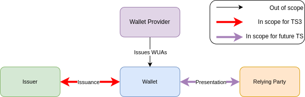

<br/>

# Specification of Wallet Unit Attestations (WUA) used in issuance of PID and Attestations

## Abstract
The present document specifies how WUA is used in connection with PID Providers and Attestation Providers.

#### [GitHub discussion](https://github.com/eu-digital-identity-wallet/eudi-doc-architecture-and-reference-framework/discussions/450)

## Versioning

| Version | Date       | Description                                                      |
|---------|------------|------------------------------------------------------------------|
| `0.1`   | 28.03.2025 | Initial version for first discussions.                           |
| `0.2`   | 14.04.2025 | Improvements after first round of feedback and improved scoping. |

	
## 1 Introduction and Overview
The WUA (Wallet Unit Attestation) topic has been discussed in the European Digital Identity Cooperation Group. As a result a number of High Level Requirements (HLRs) have been proposed. The present document is set to enable actors in the EUDIW ecosystem to follow the HLRs while ensuring the interoperability of the ecosystem. The HLRs are available in the [ARF ANNEX 2 Topic 9](https://eu-digital-identity-wallet.github.io/eudi-doc-architecture-and-reference-framework/latest/annexes/annex-2/annex-2-high-level-requirements/#a239-topic-9---wallet-unit-attestation). 

Although this document will serve as a technical specification, the current version will discuss different solutions in order to facilitate an informed discussion. 

### 1.1 WUA Use Cases (from ARF HLRs)
The HLRs of the ARF mandates that the WUA functionality must support a certain set of information to be transferred from the Wallet Provider (via the Wallet Unit) to the Issuing entities (i.e., PID Provider or Attestation Provider) and another set of information to the Relying Parties. That is the content of the WUA differs based upon which party receives the information. Additionally, the WUA functionality will be used as part of separate protocols for respective issuance and presentations. We therefore distinguish between these parts of the functionality by using the following terminology: 

* *Issuance WUA*: A Wallet Unit Attestation which information will be transferred from a Wallet Provider to the Issuer via the Wallet during issuance. Issuance WUAs must allow Issuers to determine the security level of the wallet, authenticate the wallet and check that it has not been revoked for the lifetime of the attestation they are issuing. 
* *Presentation WUA*: A Wallet Unit Attestation which information will be transferred from a Wallet Provider to a Relying Party via the Wallet during presentation. Presentation WUAs must enable a Relying Party to authenticate the wallet and check that it has not been revoked at the time of presentation.

In order to ensure interoperability, it is critical that this specification is aligned with other standards, i.e., ISO 18013-5, OpenID4VCI and OpenID4VP. This collaboration has identified several issues in relation to Presentation WUA that needs to be further discussed. To meet the current deadlines of this STS, **this technical specification will only address the Issuance WUA**. An extension to this specification (or a second specification) addressing the Presentation WUA will be added at a later stage. Note: This split is done to allow time for alignment with other protocols and standards used in the EUDIW ecosystem, e.g. OpenID4VP and ISO 18013-5. 

In the forthcoming sections, we will use this terminology when discussing the technical implementations of the respective parts of the WUA functionality.

Note that the Issuance WUA corresponds closely with the functionality of what was previously dubbed a Wallet Trust Evidence (WTE) and the functionality of a presentation WUA corresponds closely with what was previously dubbed a Wallet Instance Activation (WIA).

### 1.2 Scope of the WUA STS
The WUA STS must specify the following things:

* The *transfer* of Issuance WUAs between the wallet and the issuing party (i.e., either PID or Attestation Provider). 
* The *format* of the Issuance WUA including its encoding and integrity protection mechanism. 
* The *life cycle* of Issuance WUAs. 
* The *revocation mechanism* for Issuance WUAs.
* The *content* of the Issuance WUAs. 

Note that how Wallet Providers issue WUAs to the wallet are out of scope for the technical specification as this will only be done by the wallet providers themselves and does therefore not require any standard to achieve interoperability. 

*Note that the implementing act CIR [(EU) 2024/2977](https://eur-lex.europa.eu/eli/reg_impl/2024/2977/oj) Article 5, mandates that PID Providers can verify the revocation status of the WUA used in issuance of PID*. Hence revocation must be supported, at the very least in the context of PID issuance. How and why revocation is triggered is, however, out of scope of this specification, but note that by the legislation CIR [(EU) 2024/2979](https://eur-lex.europa.eu/eli/reg_impl/2024/2979/oj) Article 6, it must be possible for users to request the revocation of their wallet unit attestations.

Below is a simple depiction of which parts of interactions involving WUAs between different actors in the EUDIW ecosystem are in scope of the WUA specifications:

<br/><br/>

## 1.3 Design Constraints
The first and foremost design constraint is that the technical specification must enable the high level requirements defined in the ARF. Additionally it should be strived that the WUA mechanism is compatible with the existing technical specifications for the EUDIW ecosystem. I.e., the mechanism must be compatible with ISO18013-5 as well as OID4VCI, OID4VP. The goal is that the solution is technically simple and should not introduce unnecessary complexity.

## 1.4 Requirements Notation
The key words "MUST", "MUST NOT", "REQUIRED", "SHALL", "SHALL NOT", "SHOULD", "SHOULD NOT", "RECOMMENDED", "NOT RECOMMENDED", "MAY", and "OPTIONAL" in this document are to be interpreted as described in [RFC2119](https://datatracker.ietf.org/doc/html/rfc2119) [RFC8174](https://datatracker.ietf.org/doc/html/rfc8174) when, and only when, they are written in all capital letters. 

# 2 Proposed solution
A high level overview of the current solution is given in the table below:

| **Conceptual Part** | **Solution**                                                                                                                                                                                                                   |
|---------------------|--------------------------------------------------------------------------------------------------------------------------------------------------------------------------------------------------------------------------------|
| Format              | JSON Web Tokens (JWTs) signed by the Wallet Provider.                                                                                                                                                                                 |
| Transport           | The WUA shall be a `key_attestation`  extended to include a `eudi_wallet_info` object as part of the `jwt` proof of possession within the `CredentialRequest` of OID4VCI.                                                                                  |
| Content             | The `key_attestation` will include Level of Assurance (LoA) of the Wallet Unit, a public key corresponding to a private key that the Wallet Provider guarantees is stored in the corresponding WSCA/WSCD, a revocation ID and more as discussed in [Section 2.3 Content](#23-content). |
| Life Cycle          | Issued by Wallet Providers that must maintain revocation status for the validity period of the WUA.                                                                                                                             |
| Revocation          | Revocation Status List.                                                                                                                                                                                                        |

Below we present the current technical specification for Issuance WUAs in more depth as well as discuss some alternative choices. 

## 2.1 Format
A Wallet Unit Attestation SHALL be a JSON Web Token (JWT) as specified in [RFC7519](https://datatracker.ietf.org/doc/html/rfc7519).

## 2.2 Transport
The ARF specifies that OID4VCI is to be used to transport the WUA used for issuance, hence the format of the WUA shall be supported by OID4VCI. 

### 2.2.1 Options within the OID4VCI Protocol
Before, discussing the options for transport of Issuance WUAs, we briefly sketch the OID4VCI protocol. There are four entities in the protocol: 
1. An End-User.
2. A Wallet.
3. An Authorization Server
4. A Credential Issuer.

At a high-level these entities interact in the following manner:
1. The *Credential Issuer* sends a *Credential Offer* to the Wallet Unit, containing relevant information about the credential that the issuer can issue.
2. The *End-User* authorizes towards the *Authorization Server* and obtains an access token.
3. *Wallet* sends a  *Credential Request* to the *Credential Issuer* along with the previously obtained access token.
4. *Credential Issuer* sends a *Credential Response* (containing the issued credential) to the *Wallet*. 

Further details can be found here [OIDF OpenID for Verifiable Credential Issuance - draft 15](https://github.com/eu-digital-identity-wallet/eudi-doc-standards-and-technical-specifications/issues/3).

The OID4VCI protocol allows to transfer attestations from Wallet Providers to Issuers (Attestation Providers) through Wallets at two different levels: 
1. They can be sent along the Authorization Request and the Token Request from the Wallet to the Authorization Server (i.e., in step 2 of the above protocol sketch) as a [OAuth 2.0 Attestation-Based Client Authentication](https://datatracker.ietf.org/doc/draft-ietf-oauth-attestation-based-client-auth/). This is referred to as a Wallet Attestation. It is worth noting that that OAuth 2.0 Attestation-Based Client Authentication must include a Proof-of-Possession to a *Client Instance Key* key also appearing in the Wallet Attestation.
2. They can be sent in the Credential Request in a `proofs` field from Wallet to Credential Issuer (i.e., in step 4 of the above protocol sketch).

Three proof types are defined within the specification and can be sent along the Credential Request: 
* `jwt`: A JWT proof of possession (PoP) on a (list of) key(s) (i.e., a signature on challenge from context). This may also include a `key_attestation` JWT within the header of the `jwt` proof type JWT.
* `ldp_vp`: A W3C Verifiable Presentation used as PoP. 
* `attestation`: A `key_attestation` JWT which does not include a proof of possession from the Wallet. However, it may include a `nonce` from the context of the OID4VCI. This can be used to ensure the freshness of the attestation from the Wallet Provider.

The purpose of the Wallet Unit Attestation is to let the wallet authenticate towards the authorization server as a valid wallet that has not been revoked. 
The `key_attestation` has the purpose of attesting to how the secret keys, corresponding to the public keys present in the issued credentials, are stored. 

To use this to enable the HLR about the WUA functionality related to Issuance several paths forward are viable:
- **One or Two Attestations:** The functionality can be split across two different attestations from the Wallet Provider similar to Wallet Attestation of OID4VC to prove the validity of the Wallet Unit and the Key Attestation to prove the properties of the hardware storing the keys. Alternatively, the `key_attestation` object can also be used to also prove the validity of the Wallet Unit.
- **Proof Type:** Both the `jwt` proof type and the `attestation` proof type are options that can be used to fulfill the WUA functionality. The `jwt` proof type requires the Wallet to sign the `jwt` including a context specific *nonce* with one of the keys which ensures the freshness. For certain WSCDs to make such signatures, it may require the user to make a gesture to approve this. The `attestation` proof type does not require a PoP from the Wallet, as the `attestation` itself is a JWT signed by the Wallet Provider. To ensure the freshness (i.e., that the attestation cannot be replayed), the `attestation` relies on the Wallet Provider to include the *nonce* specific to the context or rely on timestamps. As a consequence, using the `attestation` proof type will require the Wallet to communicate actively with the Wallet Provider through out OID4VCI protocol. We note that this may let the Wallet Provider learn about the usage of the Wallet.
- **Including Multiple Keys:** PID Providers and other Attestation Providers will often do batch issuance of credentials. To enable this it may be necessary to transfer multiple keys from the Wallet to the Provider. This can be done on several different levels in the protocols. It is possible to include multiple `proofs` in the `proofs` field of the Credential Request, it is possible to include multiple JWTs in the `jwt` proof type, and it is possible to include multiple keys in a single `key_attestation`. Including multiple PoPs may have the implication that the user must do several gestures to approve the signing from the WSCD.

### 2.2.2 Transport of Issuance WUAs
To avoid complexity, we propose to let only one attestation to handle the functionality of issuance WUAs. I.e., we propose to extend the `key_attestation` object to be used for both the validity of the Wallet Unit and to provide the issuer with information about how the keys are stored. I.e., when referring to the Issuance WUA as a data object this data object will be a `key_attestation` with extensions as described below. 

To avoid requiring exchange of information between Wallet and Wallet Provider throughout the issuance protocol itself, we propose the `jwt` type of proof is used to handle the WUA, as this would allow for proof of possessions guaranteeing freshness without requiring the Wallet to be in online contact with the Wallet Provider throughout issuance. 

To avoid multiple user gestures, we propose to send only one `jwt` PoP and include multiple keys in the `key_attestation`. 

As the WUA will be sent as part of the *Credential Request*, we outline the dataformat of a Credential Request and highlight how and where the WUA is to be transported as well as which parts are signed by the Wallet Unit and which parts are signed by the Wallet Provider:

Toplevel *Credential Request*:
```
{
  "credential_configuration_id": "org.iso.18013.5.1.mDL",
  "proof": {
    "proof_type": "jwt",
    "jwt": "eyJraWQiOiJkaWQ6ZXhhbXBsZTplYmZlYjFmNzEyZWJjNmYxYzI3NmUxMmVjMjEva2V5cy8xIiwiYWxnIjoiRVMyNTYiLCJ0eXAiOiJKV1QifQ"
  }
}
```
The `jwt` element has the following content:

```
{
  "typ": "openid4vci-proof+jwt",
  "alg": "ES256",
  "kid": "0",
  "key_attestation":["eyJraWQiOiJkaWQ6ZXhhbXBsZTplYmZlYjFmNzEyZWJjNmYxYzI3NmUxMmVjMjEva2V5cy8xIiwiYWxnIjoiRVMyNTYiLCJ0eXAiOiJKV1QifQ"] 
}.{
  "aud": "https://credential-issuer.example.com",
  "iat": 1701960444,
  "nonce": "LarRGSbmUPYtRYO6BQ4yn8"
}
```

The `jwt` element MUST be generated and signed by the *Wallet Unit* with the key at index 0 of the `attested_keys` array within the `key_attestation` object. 

The `key_attestation` element is generated and signed by the *Wallet Provider* and is what corresponds to the WUA in the EUDI Wallet context, i.e. an attestation on the keys and attributes of the Wallet Unit. 

The `key_attestation` element has the following content. 

> Note that we add a `eudi_wallet_info` object information discussed in [Section 2.3 Content](#23-content):

```
{
  "typ": "keyattestation+jwt",
  "alg": "ES256",
  "x5c": ["MIIDQjCCA..."]
}
.
{
  "iss": "<identifier of the issuer of this key attestation - Corresponds to `WalletProviderName` in `eudi_wallet_info`>",
  "iat": 1516247022, 
  "exp": 1541493724, <optional, might be removed depending on revocation discussion>
  "status": { <optional, might be removed depending on revocation discussion>
    "status_list": {
        "idx": 412,
        "uri": "https://revocation_url/statuslists/1"
      }
  }
  "eudi_wallet_info": {JSON}
  "attested_keys": [
    {
      "kty": "EC",
      "crv": "P-256",
      "x": "TCAER19Zvu3OHF4j4W4vfSVoHIP1ILilDls7vCeGemc",
      "y": "ZxjiWWbZMQGHVWKVQ4hbSIirsVfuecCE6t4jT9F2HZQ"
    }
  ]
}
```

## 2.3 Content
The `eudi_wallet_info` object contains the following informational content of the WUA:

| Attribute | Multiplicity | Type | Description |
|---------------|--------------|-----------------------------------|--------|
| `GeneralInfo` | REQUIRED | [*GeneralInfo*](#231-generalinfo) | specifies generic information on the Wallet Unit. |
| `WSCDInfo` | REQUIRED | [*WSCDInfo*](#232-wscdinfo) | specifies information on (one of) the WSCD(s) available to the Wallet Instance. |

### 2.3.1 GeneralInfo
The `GeneralInfo` object has the following content: 

| Attribute | Multiplicity | Type | Description |
|---------------|--------------|-----------------------------------|--------|
| `WalletProviderName` | REQUIRED | *string* | **Name of Wallet Provider**, as listed on the Trusted List of Wallet Providers |
| `WalletSolutionID` | REQUIRED | *string* | **Identifier of the Wallet Solution**, as listed on the Trusted List of Wallet Providers. |
| `WalletSolutionVersion` | REQUIRED | *string* | **Version of the Wallet Solution** |
| `WalletSolutionCertificationInformation` | REQUIRED | *JSON/string* | Object containing information on which conformity assessment body certified the Wallet Solution, the applicable certification number, etc. |


### 2.3.2 WSCDInfo
The `WSCDInfo` object has the following content:

| Attribute | Multiplicity | Type | Description |
|---------------|--------------|-----------------------------------|--------|
| `WSCDID` | REQUIRED | *integer* | Unique (e.g., sequential) identifier for this WSCD within the context of the Wallet Unit, to be used for referencing this WSCD in the OpenID4VCI protocol |
| `WSCDType` | RECOMMENDED | *string* | Technical implementation of the WSCD, for instance remote HSM or external smart card |
| `WSCDSupportedAlgorithms` | REQUIRED | *JSON array of strings* | Cryptographic algorithms supported by the WSCD, named according to the IANA naming standard, for instance: ['A256CBC', 'A128CBC', 'RSA1_5'] |
| `WSCDSupportedEllipticCurves` | REQUIRED | *JSON array of strings* | Elliptic curves supported by the WSCD for ECDSA and/or ECDH, named according to the IANA naming standard, for instance: ['P-256', 'P-384', 'secp256k1'] |
| `WSCDCertificationInformation` | REQUIRED | *JSON / string* | Information about the certification achieved by the WSCD, such as under which scheme (for instance, Common Criteria, GlobalPlatform), the requirements that were evaluated (for example, the Protection Profile used), the evaluation level, and perhaps other applicable information. |
| `WSCDLoA` | REQUIRED | *integer [1-3]* | Integer representing the level of Assurance for all functions offered by the WSCD; 3 = High / 2 = Substantial / 1 = Low |

We note that relevant information related to revocation is found in the `status` object of the `key_attestation` element. In particular the value of `idx`  allows the Wallet Provider to identify the Wallet Unit and is therefore what is required by the PID provider to request a revocation of the Wallet Unit.

> [!NOTE]
>  **Question**: How much information about the WSCD is it necessary to include. Is only the LoA sufficient or must details such as supported algorithms, curves, etc also be included for the Issuer to deem the trustworthiness? :

### 2.3.3 Example
An example of the `eudi_wallet_information` object is provided below:


```
"eudi_wallet_info": {
  "GeneralInfo": {
     "WalletProviderName": "WalletCorp", 
     "WalletSolutionID": "SmartWallet-mobile",
     "WalletSolutionVersion": "1.0.1",
     "WalletSolutionCertificationInformation": "https://example.org/certification/SmartWalletMobile/1-0-1/"
  },
  "WSCDInfo": {
     "WSCDID" : 1,
     "WSCDType" : "REMOTE HSM",	
     "WSCDSupportedAlgorithms" : ["A256CBC", "A128CBC", "RSA1_5", "ES256"],
     "WSCDSupportedEllipticCurves" : ["P-256", "secp256k1"],
     "WSCDCertificationInformation" : "GlobalPlatform",
     "WSCDLoA" : 2
  }
}
```

## 2.4 Life Cycle

### 2.4.1 Requirements for Life Cycle
As previously noted it is required in the implementing acts that PID providers can continuously check that Wallet Units they have issued PIDs to are not revoked (in which case the PID must also be revoked).

Additionally, the HLRs of the ARF, specifies that the Wallet Provider must take into account security, privacy and interoperability when deciding on the lifetime of the WUA into consideration. 

The Wallet provider must also consider that the ARF specifies that: *The expiration date of the issued PID or Attestation SHALL be no later than the expiration date of the WUA presented as part of the issuance process.*

### 2.4.2 Life Cycle of WUAs
A Wallet Provider MUST choose the technical validity period of the WUA and MUST maintain the revocation mechanism i.e., see Section 2.5 for until this period has passed.
The `key_attestation` JWT contains a field `exp` denoting the technical expiration period of the `key_attestation`. 

A PID Provider MUST check the revocation status of the WUA received in relation to issuance once every 24 hours for the validity period of the PID. If the WUA is revoked, then PID Provider MUST revoke the PID. If PID Providers issue PIDs with a validity period of less than 24 hours, then they only need to verify the validity period of the WUA upon issuance.

Attestation Providers MAY check the revocation status of the WUA and revoke their attestations if the WUA is revoked. 

The technical validity period of a PID or Attestation MUST end before the technical validity period of the issuance WUA shown to the PID or Attestation Provider in the issuance process.

During re-issuance of a PID or Attestation (i.e., if for example the technical validity of a PID or Attestation expires before the administrative validity period expires), then the Wallet Unit (or Attestation Provider) MUST send a new WUA (i.e., a WUA that has not been used in relation to issuance before) in the *Credential Request* to the PID or Attestation Provider. 
> Note it is required to be a new WUA as the keys should be different from previous WUA in order to prevent linkability of keys upon presentation. 

## 2.5 Revocation
In this section, we list and discuss possible revocation methods before specifying the chosen solution. 
We will use the following abbreviations when discussing the solutions. 

### 2.5.1 Revocation Options
*n*: number of WP users.
*n_iss*: number of Wallet Units using the issuer.
*m*: Avg. number of issuers of PID or Attestestions used by each Wallet Unit.

| Name of method | Description        | Pro  |  Cons                        |   
|---------|-------------|----------------------------------|---------------------------|
| Status list  | Each attestation contains a random (unique pr. issuer) revocation identifier generated and stored by the WP. When the WP revokes a Wallet Unit, it will add the identifiers of that Wallet Unit to the public revocation list, which contains all revoked identifiers. | Conceptually easy to understand and generally well supported. The WP does not learn which wallet units access which issuers, only that a issuer has accessed the status list. The status list is fairly static and can be published using a CDN or similar technologies. | The WP needs to maintain the status for *n x m* identifiers. |
| Chunked status list | Instead of publishing all revocations on a single status list, the WP may opt to publish the revocations of a subset of the attestations on separate lists. This chunking could be based on the date of issuance, i.e. revocations related to attestations issued on 1/1/2026 can be found on URI A and revocations related to attestations issued on 2/1/2025 can be found on URI B, etc. | This will reduce the size of each status list. | All parties need to keep track of both the revocation identifier and additional information (date of issuance). |
| Secret seed PRNG status list | The WP stores a secret seed for each Wallet Unit. This seed is used to generate the revocation identifier. When the WP revokes a Wallet Unit, it will add the secret seed to the public revocation list, allowing the issuers to compute the revocation identifiers. Otherwise this functions as a status list. | The WP will only need to maintain the status for *n* seeds. | After revocation, the seed is published, making it possible to compute and thereby link the revocation identifiers.|  
| Online status protocol | Instead of the issuer downloading a complete status list, the issuer queries the WP for the status of each individual Wallet when doing a revocation check. Note that the Wallet identifier used in this approach can be generated by hashing the issuer identifier and a secret key shared between the Wallet Unit and Wallet Provider. | The WP only needs to maintain the status for the *n* Wallet Units. The Issuer only needs to process the relevant *n_iss* Wallet Units.| Each request will require the WP to do a lookup and cannot be distributed as static data. The WP also learns which issuers have been accessed by the Wallet Unit.| 
| Wallet Type lookups | The 'Status list' and 'Online status protocol' methods can be modified to operate on "Wallet types" rather than individual wallets. Instead of a revocation id, the WUA will contain a "Wallet type" attribute, which can be used to revoke "classes" of Wallet Units.| As there will be a very small (compared to individual Wallet Units) number of wallet types, computational complexity and privacy issues are minimal. | The approach does not allow for revocation of individual Wallet Units, which is required for PID use cases. |
| Short lived attestations | As an alternative to revocation, the WUA can expire less than 24 hours after issuance, this would eliminate the need for revocation altogether. | WP does not need to maintain revocation status. | WP will often have to perform verifications of the integrity of the Wallet Unit. Short lived attestations will not accomodate the legal requirement for PID providers to check the revocation status of the Wallet Unit. |

### 2.5.2 Revocation proposal

With the above solutions in mind, we propose to use the chunked status list described in Section 2.5.1, i.e. a separate status list is generated for all WUAs issued each single day. The URI will have a format similar to: 
`https://revocation_url/statuslists/2024/12/24/` for WUAs issued on Dec. 24, 2024. We note that status lists encourage compression, which will reduce the size in general. It is also possible to do additional chunking to further reduce the status list sizes. A similar approach to revocation status list are used elsewhere in the ARF and it would be preferable if the same method could also be used for WUA.

Regarding the scalability of the described proposal, a rough calculation of the complexity for a status list corresponding to one day is provided below:
Assuming a Wallet Provider servicing 80 mio. Wallet Units, each having 10 WUAs issued per day (in order to support each wallet obtaining 10 new types of attestations per day), this will result in revocation information for one day for 8 * 10^8 WUAs. Assuming 64 bits are used for the revocation identifier, the stored revocation information will require roughly 6.4 GB of storage. The (uncompressed) status list will therefore be around 6.4 GB per day. However, very high compression rates are expected due to the nature of the status lists, and the compressed lists are estimated to be in the size of MBs.

We note that each wallet having 10 different credentials to issue each day probably is an exaggerated estimate by a factor of 5-10 depending on the life-time of the credentials. 
 
> Note that if this is deemed impractical, then the size of the chunks of the status list can be reduced further. For example it could be reduced to 10^5 which will give a compressed bit string status list in the range of hundreds of bytes. 

> We note that revocation status lists are also natively supported by the *key_attestation* element in OID4VCI.

# Appendix

## Appendix 1
**Table 4 is kept for the discussion of the development of the STS. It may not be relevant and should be removed before the final document is released.**

Table 4:
| Name of data object | Description        | Encoding                                  | 
|---------|-------------|--------------------------------------------------------------|
| DeviceEngagement QRCode | Wallet Instance and User device support device engagement using QR code, as specified in [ISO/IEC 18013-5]. | Boolean | 
| DeviceEngagement NFC | Wallet Instance and User device support device engagement using NFC, as specified in [ISO/IEC 18013-5]. | Boolean |
| DeviceRetrievalBLE | Wallet Instance and User device support device retrieval using BLE, as specified in [ISO/IEC 18013-5]. | Boolean |
| DeviceRetrievalNFC | Wallet Instance and User device support device retrieval using NFC, as specified in [ISO/IEC 18013-5]. | Boolean |
| DeviceRetrieval WiFiAware | Wallet Instance and User device support device retrieval using Wi-Fi Aware, as specified in [ISO/IEC 18013-5]. | Boolean |
| OfflineSupport | Wallet Instance is able to perform device engagement and device retrieval when User device is offline. Please also refer to WSCDType in Table 5. | Boolean |
